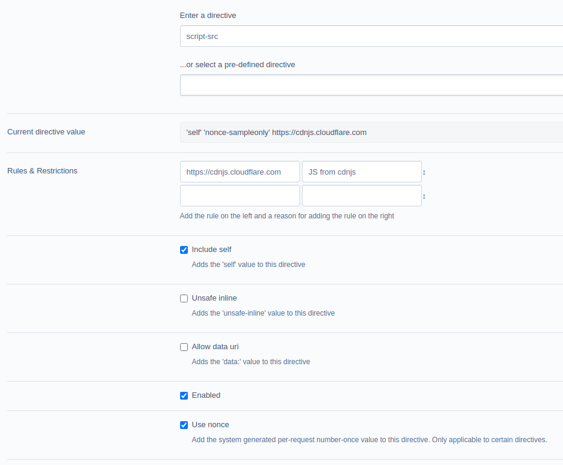

# Using a nonce

## Background

The module will set a nonce ('number once') per request, which will be applied to relevant elements in the page prior to output. This is a handy way to whitelist trusted, inline scripts or styles that are added by modules.

In order to use the nonce in the relevant elements, the directive value "Use Nonce" must be checked in the Directive's administration screen.

### Example



In the above:

+ Allow scripts to be loaded from the current domain
+ Allow scripts from cdnjs.cloudflare.com
+ Allow inline scripts that have the nonce

## Nonce creation

Application of the nonce occurs:
+ in the injected `NSWDPC\Utilities\ContentSecurityPolicy\NonceRequirements_Backend` OR
+ in middleware regardless of the Requirements backend used

The default method is the former, set via the `NSWDPC\Utilities\ContentSecurityPolicy\Policy.nonce_injection_method` config option. The supported values are `requirements` or `middleware`, respectively.

> Only inline scripts and style elements added by the Requirements API will receive the request nonce attribute

Any element added outside the Requirements API will not receive a nonce. To whitelist these you should add a matching SHA256, SHA384 or SHA512 [SRI hash](https://developer.mozilla.org/en-US/docs/Web/Security/Subresource_Integrity) of everything between the `<script>` or `<style>` tags.

Any remaining inline scripts and styles injected into the page will be blocked by supporting browsers.

### Examples

Before nonce
```html
<script>var = 'foo';</script>
<style type="text/css">
body {
    color : 'chartreuse';
}
</style>
```

After nonce
```html
<script nonce="request_nonce">var = 'foo';</script>
<style nonce="request_nonce" type="text/css">
body {
    color : 'chartreuse';
}
</style>
```

## Further information

Most websites will make use of inline scripts to perform certain actions. This can be as simple as an onload attribute in an `````` tag or use of Google Tag Manager.

Services like Google Tag Manager rely on the ability to run scripts on your website to modify or add features to the website. These will be blocked by your CSP.

One workaround is to use the ```unsafe-inline``` and/or ```unsafe-eval``` to allow these scripts; but as the same suggests this is 'unsafe'. Any attacker that can inject scripts onto a web page would then bypass the Policy which is not the desired result.

To work with inline scripts or styles, choose one or more of the following:

+ remove inline event handlers if possible. Do you really need onload/onclick handlers? These can be moved into an external script.
+ try to move any scripts in the tags to external resources loaded from an approved host name.
+ use a hash of the tag contents to approve specific approved content
+ use a nonce (**n**umber **once**) on all approved tags
+ use the `strict-dynamic` directive

### Alternative: using an integrity hash

CSP allows you to use a hash of the contents of a script or style tag to be added to the relevant directive, such that inline resources matching the hash are allowed to run.

Consider the following script without a nonce

```html
<script> var foo = 'bar'; </script>
```

Using a sha256 hash, this will produce the following value:

```html
sha256-TtP3pUooIY6AQqO/ARoT0XwDLJ5XkPvFN7Pr5uJynHk=
```

The method of obtaining this value is as follows, in PHP, noting the leading/trailing whitespace inclusion:
```
php -a
php > print 'sha256-' . base64_encode( hash("sha256", " var foo = 'bar'; ", true) );
sha256-TtP3pUooIY6AQqO/ARoT0XwDLJ5XkPvFN7Pr5uJynHk=
```

When generating a value, note the following information from the CSP spec:

>  When generating the hash, don't include the ```<script>``` or ```<style>``` tags and note that capitalisation and whitespace matter, including leading or trailing whitespace

Once you have obtained the hash value, it can be added to the relevant directive.

Some browsers will report the required hash that needs to be added to the policy but you should ensure this is the hash of a valid script prior to whitelisting it!

> Inline scripts that are added dynamically will need to have a hash generated for them. If you use a service such as Google Tag Manager, this is something to be aware of.

## Dynamically generated scripts

If you have the misfortune of loading inline scripts that return modified contents when requested then you will find these difficult to allow unless they can be hosted under a URL that is whitelisted. Try contacting the author of the script if this is the case.
